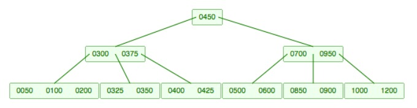
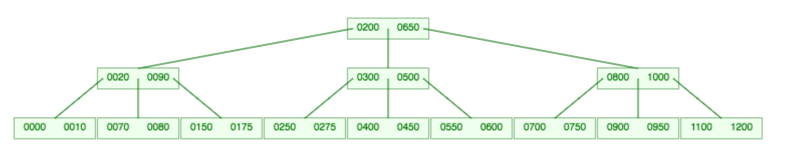
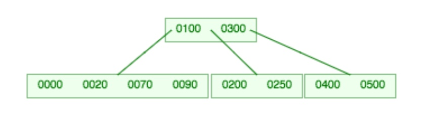

# Lecture 10 Answers

a) Solution: When 375 gets inserted into the tree, it gets inserted into the leaf node containing the keys 325, 350, 400, and 425. Since the B-tree is of order 5, nodes can only hold 4 keys. Hence we must split the leaf node and promote the middle element, which is 375, to the parent node. When we promote 375 to the parent node, it also overflows and must be split in two. We promote the middle element, which is 450, and it becomes the new root of the tree. The new tree is shown below:

b) Solution: 700 gets inserted into the leaf node containing the keys 550, 600, 650, and 750. Since the B-tree is of order 5, nodes can hold only 4 keys. Hence we must split the leaf node and promote the middle element, which is 650 (once 700 is included, we have 550, 600, 650, 700, and 750) to the parent node. When we split the leaf node, 550 and 600 go into the left leaf node and 700 and 750 go into the right leaf node.

When 650 gets promoted to the parent node, the parent node overflows because it can only hold 4 keys. Again 650 is the middle key (300, 500 650, 800, and 1000 are the keys) so we promote 650 to the root node and split the parent node. 300 and 500 move into one node and 800 and 1000 move into the other node. The resulting tree is shown below:

c) Solution: When we delete 80 from its leaf node, the leaf node no longer has the minimum number of keys. It first looks to see if it can take a key from either its left or right sibling, but both siblings have the minimum number of keys as well. Hence the leaf node must merge with its left sibling, which is the leaf node containing the keys 0 and 20. When this merger occurs, 70 gets demoted from the parent and included in the new leaf node because 70 used to point to the two separate leaf nodes and now they have been merged. Thus 70 must get bundled into the new leaf node as well. The resulting BTree is shown below:

